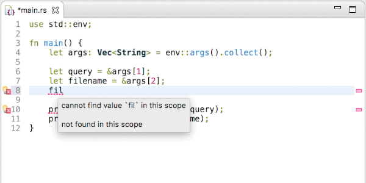
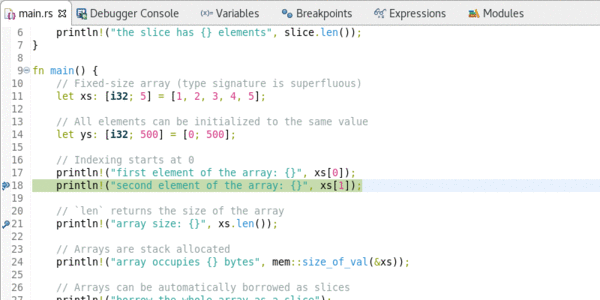
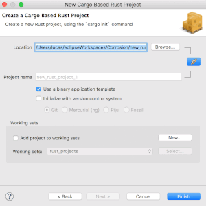
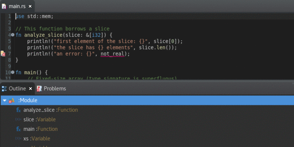

# Eclipse Corrosion
### Rust edition and debug in Eclipse IDE

Corrosion is a Rust development plugin for the Eclipse IDE, providing a rich edition experience through integration with the Rust Language Server and Cargo. Available for download as a complete Eclipse package (See above), full Rust development support is just one click away.

## Download/Install

Download [The Eclipse IDE for Rust Developers Package](https://www.eclipse.org/downloads/packages/release/photon/r/eclipse-ide-rust-developers-includes-incubating-components). With installation of plugins required, it is the easiest way to start developing Rust projects. _Java must be installed to run this IDE_

*OR*

From a working Eclipse IDE, find [Eclipse Corrosion](https://marketplace.eclipse.org/content/corrosion-rust-edition-eclipse-ide) on Eclipse Markerplace ([how to install from marketplace](https://marketplace.eclipse.org/marketplace-client-intro?mpc_install=3835145))

*OR*

From a working Eclipse IDE, install from p2 repository [http://download.eclipse.org/releases/latest/](http://download.eclipse.org/releases/latest/) (or [http://download.eclipse.org/corrosion/snapshots/](http://download.eclipse.org/corrosion/snapshots/) for development builds).

## Features

Corrosion brings together multiple different sources of features to make an enjoyable developing environment. Here are just a few of the most common features. Download today to discover all Corrosion has to offer.

### Rust Language Server
The RLS supplies Corrosion with the majority of the edition abilities. More information can be found at the [RLS GitHub Repository](https://github.com/rust-lang-nursery/rls).
 - Completion Assist
 - Documentation Hover
 - Diagnostics
 - Formatting

### Debug
Using the rust-gdb, Corrosion enables users to debug their Rust programs with intelligent supports.
 - Variables View
 - GDB Console
 - Breakpoints
 - Expression Execution

### Cargo and Rustup Integration
Corrosion is built for all Rust developers, newcomers to experts, bringing a GUI to common Cargo features.
 - New Project Wizard
 - Toolchain Management
 - TOML file editing support
 - Export Crate Wizard
 - Rust Language Server Preferences

### Eclipse Integration
Corrosion fits right into the standard Eclipse workflow welcoming previous Eclipse users
 - Project Outline
 - Dark Theme
 - Problems View
 - Git integration (Only available in Corrosion Package)

## Contributing
Corrosion is always open to new features and pull requests. If you have a feature or bug you wish to work on, [file an issue](https://github.com/eclipse/corrosion/issues) and other Corrosion developers will be able to help you get started.

Refer to our [Contributing Guide](CONTRIBUTING.md) for more instructions.

## Concept

### Prerequisites

The Rustup and Cargo commands are required for accessing the language server and performing most tasks. Go into the Rust preferences and either install the commands or input their paths if not automatically found.

### Project Overview
For the **edition**, Corrosion uses the [lsp4e](https://projects.eclipse.org/projects/technology.lsp4e) project to integrate with the [Rust Language Server](https://github.com/rust-lang-nursery/rls) and [TM4E](https://projects.eclipse.org/projects/technology.tm4e) project to provide syntax highlighting in order to provide a rich Rust editor in the Eclipse IDE.

**Initialization, import and export** of projects and execution are provided by integration with `cargo` command.

**Debugging** is provided by integration with `rust-gdb`.

 > Corrosion was formerly called RedOx, but required a name change due to naming overlap with another project ([See issue #24](https://github.com/eclipse/corrosion/issues/24))

### License

Corrosion is an open-source project licensed under [The Eclipse Public License - v 2.0](https://www.eclipse.org/legal/epl-2.0/)

The Rust and Cargo logos are owned by Mozilla and distributed under the terms of the [Creative Commons Attribution license (CC-BY)](https://creativecommons.org/licenses/by/4.0/) ([More Info](https://www.rust-lang.org/en-US/legal.html)).

[More Licensing Information](NOTICE.md)